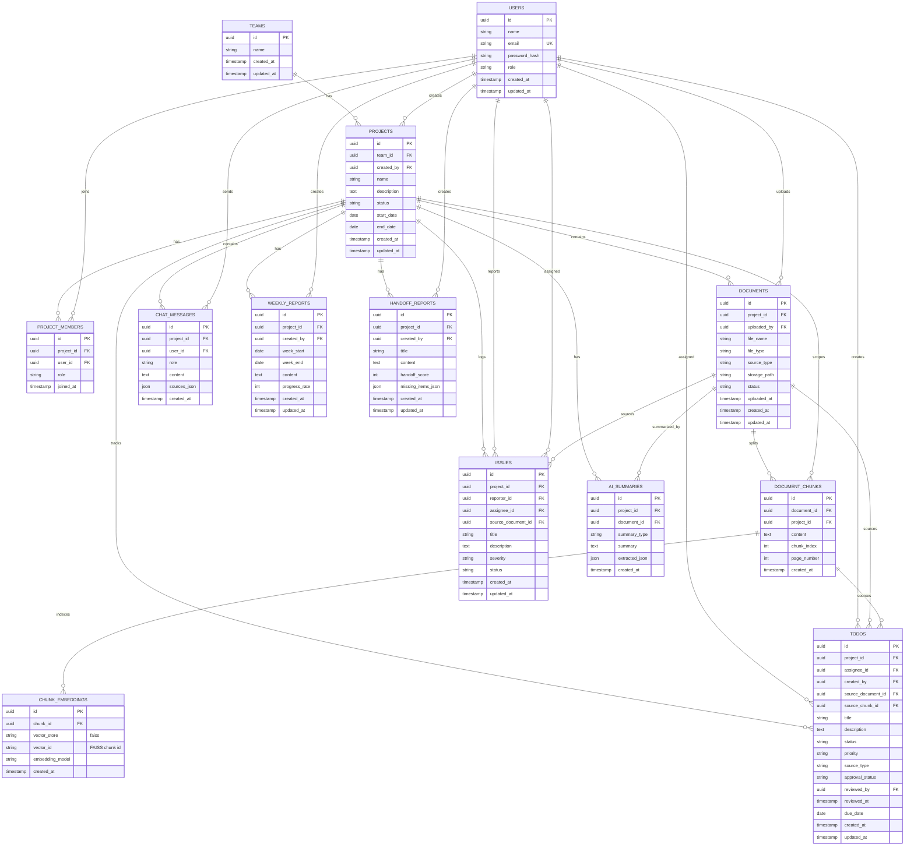

# TeamMemory DB Design

TeamMemory is project-centered. Documents, todos, issues, chat messages, reports, summaries, and handoff artifacts belong to a project. Users are connected as uploaders, authors, assignees, reporters, and project members.

## ERD

## Notes

- `project_members` is the N:M bridge between users and projects and stores the project role.
- `document_chunks` keeps `project_id` to make project-scoped RAG filtering cheap and explicit.
- `chunk_embeddings` stores only FAISS metadata. The embedding vector itself is not stored in PostgreSQL.
- AI-extracted todos and manually-created todos share the `todos` table. Use `source_type` (`ai` or `manual`) and `approval_status` (`pending`, `approved`, `rejected`) to split them in the Todo page.
- `chat_messages.sources_json` stores answer citations such as `document_id`, `chunk_id`, `file_name`, and `page_number`.
- `ai_summaries.extracted_json` stores flexible AI outputs such as summaries, extracted issue candidates, and optional decisions. Approved Todo items live in `todos`.
